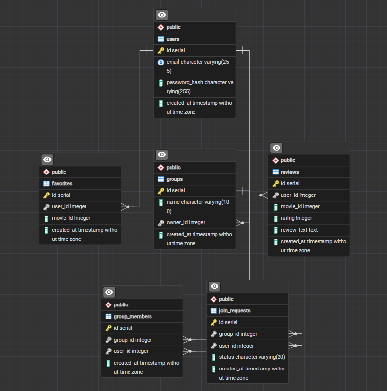

# Tietokantakaavio

## Yleiskuvaus

Elokuvasovelluksen tietokanta koostuu seitsemästä taulusta:

- users
- reviews
- favorites
- groups
- group_members
- join_requests
- group_movies

Tietokanta mahdollistaa käyttäjien hallinnan, elokuvien arvostelut, suosikkilistat sekä käyttäjäryhmät ja liittymispyynnöt.

---

# ER-kaavio

---

# Taulujen kuvaus

## users

Sisältää käyttäjien kirjautumistiedot.

Kentät:

- id
- email
- password_hash
- created_at

Yksi käyttäjä voi:

- kirjoittaa useita arvosteluja
- lisätä useita suosikkeja
- luoda useita ryhmiä
- kuulua useisiin ryhmiin

---

## reviews

Sisältää käyttäjien elokuva-arvostelut.

Kentät:

- id
- user_id
- movie_id
- rating
- review_text
- created_at

Yksi arvostelu kuuluu aina yhdelle käyttäjälle.

---

## favorites

Sisältää käyttäjien suosikkielokuvat.

Kentät:

- id
- user_id
- movie_id
- created_at

Yhdellä käyttäjällä voi olla useita suosikkeja.

---

## groups

Sisältää käyttäjien luomat ryhmät.

Kentät:

- id
- name
- owner_id
- created_at

Jokaisella ryhmällä on omistaja.

---

## group_members

Sisältää ryhmien jäsenet.

Kentät:

- id
- group_id
- user_id
- created_at

Taulu yhdistää käyttäjät ja ryhmät.

---

## join_requests

Sisältää ryhmiin liittymistä varten lähetetyt pyynnöt.

Kentät:

- id
- group_id
- user_id
- status
- created_at

Status voi olla:

- pending
- approved
- rejected

---

## group_movies

Sisältää ryhmäsivuille lisätyt elokuvat.

Kentät:

- id
- group_id
- movie_id
- title
- poster
- year
- added_by
- created_at

Sama elokuva voi olla yhdessä ryhmässä vain kerran.

---

# Taulujen suhteet

users → reviews

Käyttäjä voi kirjoittaa useita arvosteluja.

users → favorites

Käyttäjä voi lisätä useita suosikkeja.

users → groups

Käyttäjä voi luoda useita ryhmiä.

groups → group_members

Ryhmällä voi olla useita jäseniä.

users → group_members

Käyttäjä voi kuulua useisiin ryhmiin.

groups → join_requests

Ryhmään voidaan lähettää liittymispyyntöjä.

users → join_requests

Käyttäjä voi lähettää liittymispyyntöjä ryhmiin.

groups → group_movies

Ryhmällä voi olla useita elokuvia.

users → group_movies

Käyttäjä voi lisätä elokuvia ryhmiin, joissa hän on jäsenenä.

---

# Tietokannan käyttötarkoitus

Tietokanta tukee kaikkia projektin keskeisiä toimintoja:

- käyttäjien rekisteröityminen
- kirjautuminen
- arvostelujen lisääminen
- suosikkilistat
- ryhmien luonti
- ryhmiin liittyminen
- liittymispyyntöjen käsittely
- elokuvien lisääminen ryhmäsivulle
